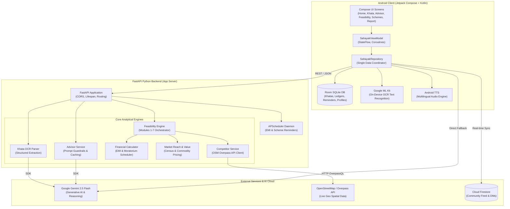

# SahayakAI (सहायक AI)
### *Next-Gen Rural Micro-Entrepreneur Financial Advisory, Khata Digitization & Business Feasibility Platform*

[](https://sih.gov.in)
[](https://sih.gov.in)
[](https://developer.android.com)
[](https://fastapi.tiangolo.com)
[](https://python.org)
[](https://ai.google.dev)
[](LICENSE)

---

## 📌 Executive Summary

India is home to over **63 million micro, small, and medium enterprises (MSMEs)**, with over 80% located in rural and peri-urban hubs. Despite driving local economies, the majority of small shopkeepers, tea stall vendors, tailors, dairy farmers, and artisans remain **credit-invisible** to formal banking institutions (such as scheduled commercial banks, regional rural banks, and NBFCs). 

Key challenges faced by rural micro-entrepreneurs:
1. **Manual Paper Bahi-Khatas**: Ledger transactions and customer debt (*udhaar*) are maintained on paper notebooks prone to loss, damage, and lack of mathematical auditability.
2. **Predatory Informal Lending**: Without a verifiable financial trail, entrepreneurs are forced to borrow from local moneylenders at exorbitant interest rates ranging from **36% to 60% per annum**.
3. **Information Asymmetry**: Entrepreneurs lack real-time Mandi market commodity pricing, seasonal demand forecasting, and inventory timing insights.
4. **Subsidized Scheme Inaccessibility**: Government credit programs (such as PM Mudra, PMEGP, PM SVANidhi, PM Vishwakarma, and KCC) remain underutilized due to complex eligibility criteria and lack of bank-ready project proposals.
5. **Business Feasibility Uncertainty**: When starting or expanding a venture, rural entrepreneurs lack access to demographic data, competitor density maps, and cashflow viability modeling.

**SahayakAI (सहायक AI)** bridges this gap by delivering a **voice-first, multilingual, AI-powered copilot** designed specifically for Bharat. Combining on-device machine intelligence, Google Gemini 2.5 Flash reasoning with trade guardrails, computer vision OCR, OpenStreetMap competitor mapping, and mathematical credit scoring, SahayakAI empowers micro-entrepreneurs to digitize their operations, protect their margins, and access formal credit.

---

## 🚀 Core Features & Architectural Modules

### 1. 🎙️ Multilingual Voice-First AI Advisor (`AdvisorScreen`)
* **Gemini 2.5 Flash Integration**: Context-aware conversational agent capable of understanding mixed colloquial queries in Hindi and English (e.g., *"मेरी किराने की दुकान में उधार बहुत बढ़ गया है, क्या करूँ?"*).
* **Trade-Grounded Prompt Guardrails**: Built on a single source of truth (`BUSINESS_PROFILES`), restricting recommendations strictly to actionable micro-enterprise topics (procurement, inventory preservation, customer retention, pricing) and preventing hallucinations.
* **Dual Execution Pipeline**:
  - **Live Online Tier**: Direct backend endpoint (`/chatbot/query`) or client-side Gemini Flash API.
  - **Graceful Offline Heuristic Fallback**: Pre-indexed trade rules run seamlessly when rural network connectivity drops.
* **Text-to-Speech (TTS) & Audio Interaction**: Integrated speech synthesizer for voice readouts tailored for low-literacy entrepreneurs.

### 2. 📖 Smart OCR Khata Digitizer & Udhar Manager (`KhataScreen`)
* **Camera / Gallery OCR Capture**: Allows vendors to photograph physical bahi-khata notebook pages.
* **Dual OCR Processing Engine**:
  - **On-Device Vision**: Google ML Kit Text Recognition with heuristic pattern parsing.
  - **Server-Side LLM Vision**: Gemini 2.5 Flash structured ledger extraction converts raw, unordered lines into structured double-entry records (`CREDIT / Jama`, `DEBIT / Kharch`, `CUSTOMER_UDHAAR`).
* **Audited Khata Review UI**: Shopkeepers can verify, edit, and categorize parsed amounts, customer names, and dates prior to persisting them into local storage.
* **Customer Udhar & Settlement Tracking**: Tracks pending dues, due dates, customer balances, and generates WhatsApp/SMS settlement reminders.

### 3. 📈 Mandi ML Commodity Forecasting & Procurement AI (`MlForecastingScreen`)
* **Commodity Coverage**: Tracks 12-month historical and forward-looking price trajectories for essential commodities:
  - Nashik / Local Onions
  - Mustard Oil (Kacchi Ghani)
  - Sharbati Wheat / Atta
  - Pure Cow/Buffalo Raw Milk
  - Cold Storage Potatoes
  - M-30 Refined Sugar
  - Cotton Fabric & Silage / Cattle Feed
* **Multi-Horizon Forecasting**: 7-day, 15-day, and 30-day price trend forecasts with **Bullish (↗)**, **Bearish (↘)**, and **Stable (→)** indicators.
* **Smart Reorder & Bulk Procurement Calculator**: Computes recommended safety stock days, reorder quantities, working capital requirements, and projected savings on bulk procurement.

### 4. 🏆 Alternative Financial Health Score & Bank-Ready Proof (`FinanceReportScreen`)
* **0 to 900 Proprietary Scoring Engine**: Evaluates creditworthiness for unbanked micro-entrepreneurs without requiring traditional CIBIL scores.
* **5 Core Algorithmic Pillars**:
  1. *Cashflow Consistency* (25%): Cadence, volume, and regularity of daily transactions.
  2. *Udhaar Recovery Rate* (25%): Ratio of recovered debt vs. pending customer receivables.
  3. *Operating Profitability* (25%): Monthly net margin (`Total Credit - Total Debit`).
  4. *Working Capital Runway* (15%): Cash reserves measured against average daily expenses.
  5. *KYC & Community Trust* (10%): Verified credentials and peer endorsements.
* **Exportable Bank-Ready Certificate**: Generates a shareable financial summary accepted by microfinance institutions (MFIs), Regional Rural Banks (RRBs), and NBFCs for PMMY Mudra loan applications.

### 5. 📊 Business Feasibility Analyzer (SIH Problem Statement SIH26091) (`FeasibilityScreen`)
A 7-module automated feasibility engine running on both the FastAPI backend and Android client:
* **Module 1: Competitor Density Mapping**:
  - Geocodes target business locations (village/block/city).
  - Queries OpenStreetMap Overpass API in real time within a 5.0–7.5 km radius.
  - Returns competitor counts, proximity clusters, and business density notes without LLM guesswork.
* **Module 2: Market Reach & Consumer Demographics**:
  - Estimates addressable consumer base using Census and regional population statistics.
  - Formulates distribution channel strategies (local retail, weekly haats, B2B wholesale).
* **Module 3: Product Pricing & Market Value**:
  - Dynamically prices goods using current Mandi spot rates, processing margins, and local price elasticity.
* **Module 4: Grounded Qualitative SWOT Analysis**:
  - Generates location-specific Strengths, Weaknesses, Opportunities, and Threats tied directly to competitor density and infrastructure.
* **Module 5: Project Cost Structure**:
  - Computes optimal debt-to-equity capital mix based on available entrepreneur margin money.
* **Module 6: 8-Quarter Financial EMI Amortization Schedule**:
  - Models repayment schedules across 2 to 7 year tenures.
  - Factors in loan moratoriums (3 to 6 months grace period) with exact principal, interest, and residual balance breakdown.
* **Module 7: Consolidated Feasibility Report**:
  - End-to-end exportable report synthesized across all 6 submodules.

### 6. 🏛️ Government Schemes & Automated Reminder Daemon (`SchemesScreen`)
* **Intelligent Profession-Based Filtering**: Matches trade profiles to central and state welfare programs:
  - **PM Mudra Yojana (PMMY)**: Shishu (₹50k), Kishore (₹5L), and Tarun (₹10L) collateral-free loans.
  - **PMEGP**: Up to 35% credit-linked capital subsidy for rural manufacturing and services.
  - **PM SVANidhi**: Working capital loans (₹10k → ₹20k → ₹50k) with 7% interest subsidies for street vendors.
  - **PM Vishwakarma**: ₹15,000 modern toolkit grant + 5% concessional credit for 18 artisan trades.
  - **KCC Animal Husbandry & Dairy**: Working capital at 4% effective interest rate.
* **Background Scheduler Daemon (`APScheduler`)**:
  - Autonomous cron scheduler running in FastAPI.
  - Dispatches automated notifications for loan EMI deadlines, scheme application cutoffs, and GST/local tax filings.

### 7. 🤝 Community Network & Trust-Based KYC Sandbox (`CommunityAndKycScreen`)
* **Peer-to-Peer Micro-Entrepreneur Forum**: Localized discussion boards where shopkeepers share wholesale supplier contacts, price alerts, and business tips.
* **Direct Messaging (DM)**: Real-time bilateral messaging between business owners.
* **Digital KYC Verification Sandbox**:
  - Aadhaar OTP verification simulator.
  - PAN structure and checksum verification.
  - Penny-drop bank account validation.
  - DigiLocker credentials sandbox for instant identity verification.

---

## 🏗️ System Architecture



---

## 🧮 Mathematical Formulations & Algorithms

### 1. Financial Health Score (FHS) Algorithm
The overall Financial Health Score $S \in [0, 900]$ is computed as a weighted sum of five key performance dimensions:

$$S = \sum_{i=1}^{5} w_i \cdot s_i$$

Where weights and factors are defined as:
* **$s_1$ Cashflow Consistency (Weight $w_1 = 0.25$)**:
  $$s_1 = \min\left(100, \frac{N_{\text{tx}}}{15} \times 100\right)$$
  *(scaled based on 30-day transaction cadence)*
* **$s_2$ Udhaar Recovery Rate (Weight $w_2 = 0.25$)**:
  $$s_2 = \begin{cases} 
  100 & \text{if } U_{\text{total}} = 0 \\
  \left(\frac{U_{\text{recovered}}}{U_{\text{total}}}\right) \times 100 & \text{if } U_{\text{total}} > 0 
  \end{cases}$$
* **$s_3$ Operating Margin Ratio (Weight $w_3 = 0.25$)**:
  $$\text{Margin} = \frac{\text{Credit} - \text{Debit}}{\text{Credit}}$$
  $$s_3 = \text{clamp}\left(\frac{\text{Margin} - 0.05}{0.30 - 0.05} \times 100, 10, 100\right)$$
* **$s_4$ Working Capital Runway (Weight $w_4 = 0.15$)**:
  $$\text{Runway Days} = \frac{\text{Net Cash Reserves}}{\text{Average Daily Debit}}$$
  $$s_4 = \min\left(100, \frac{\text{Runway Days}}{30} \times 100\right)$$
* **$s_5$ Trust & KYC Factor (Weight $w_5 = 0.10$)**:
  $$s_5 = 40\,(\text{Aadhaar}) + 30\,(\text{PAN}) + 20\,(\text{Bank Verified}) + 10\,(\text{Peer Rating})$$

Final Score Mapping:
* **750 – 900**: Prime Micro A+ (Eligible for Mudra Tarun up to ₹10L, 8.5% interest)
* **650 – 749**: Good Micro B (Eligible for Mudra Kishor up to ₹5L, 9.5% interest)
* **550 – 649**: Fair Micro C (Eligible for Mudra Shishu up to ₹50k, 10.5% interest)
* **Below 550**: Emerging Micro D (Recommended for PM SVANidhi ₹10k collateral-free credit)

---

### 2. Loan Structure & Moratorium Amortization
For rural project feasibility modeling:
* **Project Cost Estimation**:
  $$\text{Project Cost} = \frac{\text{Available Margin Capital}}{\text{Margin Ratio}} \quad (\text{Default Margin Ratio} = 10\%)$$
* **Loan Principal**:
  $$P = \min(\text{Project Cost} \times 0.90, \text{Scheme Maximum Cap})$$
* **Quarterly EMI Calculation**:
  Given annual interest rate $R$, quarterly rate $r = \frac{R}{4 \times 100}$, total quarters $N = 4 \times T$, and moratorium quarters $M = \frac{\text{Moratorium Months}}{3}$:
  
  During Moratorium ($q \le M$):
  $$\text{EMI}_q = P \times r \quad (\text{Simple Interest Only}), \quad \Delta P_q = 0$$
  
  During Repayment ($q > M$):
  $$\text{EMI}_q = P \times \frac{r(1+r)^{N-M}}{(1+r)^{N-M} - 1}$$
  $$\text{Interest}_q = \text{Balance}_{q-1} \times r$$
  $$\text{Principal}_q = \text{EMI}_q - \text{Interest}_q$$
  $$\text{Balance}_q = \text{Balance}_{q-1} - \text{Principal}_q$$

---

## 📡 REST API Specification (FastAPI Backend)

The backend provides direct endpoints matching SIH specification requirements and standard API v1 routes:

| Method | Endpoint | Description | Input / Parameters | Response Highlights |
|---|---|---|---|---|
| `GET` | `/health` | Server health, APScheduler state, and Gemini connectivity | None | `status`, `scheduler`, `gemini_pipeline` |
| `POST` | `/chatbot/query` | Trade-grounded AI advisor query (primary endpoint) | `query`, `business_type`, `location`, `language` | `advice_text`, `source_tag`, `validation_passed` |
| `GET` | `/chatbot/profiles` | Single source of truth for business profiles | None | Supported trade parameters, schemes, inputs |
| `GET` | `/chatbot/forecasts` | Mandi commodity price forecasts | `business_type` (optional filter) | 30-day forecast, trend direction, safety stock |
| `POST` | `/feasibility/full-report` | Runs all 7 feasibility modules together | `location`, `available_margin`, `business_category` | Consolidated SWOT, competitor density, 8-Q EMI |
| `POST` | `/feasibility/analysis` | Standalone qualitative SWOT & competitor mapping | `location`, `business_category` | `count_nearby`, `density_note`, `swot` |
| `POST` | `/feasibility/calculator` | Project structure and quarterly repayment schedule | `available_margin` | `project_cost`, `loan_amount`, `schedule` |
| `GET` | `/feasibility/categories` | Fixed list of supported business categories | None | List of 10 business categories |
| `POST` | `/api/v1/khata/parse-ocr` | Gemini 2.5 Flash structured ledger extraction | `raw_text`, `business_type` | List of structured `OcrItem` objects |
| `GET` | `/api/v1/schemes/` | Filtered government schemes list | `business_type` (e.g. `KIRANA`) | Subsidies, max loan caps, ministry details |
| `GET` | `/api/v1/schemes/reminders` | Retrieve scheduled EMI/scheme reminders | None | List of active reminders |
| `POST` | `/api/v1/schemes/reminders` | Create automated loan EMI or tax reminder | `title`, `amount`, `due_date`, `category` | Created reminder object with unique ID |
| `POST` | `/api/v1/kyc/verify` | Sandbox KYC document verification | `doc_type` (AADHAAR/PAN/BANK), `doc_number` | `verified: true`, confidence score, masked ID |

---

## 🏢 Supported Micro-Enterprise Profiles

SahayakAI defines trade profiles in both Python (`app/core/business_profiles.py`) and Kotlin (`com.example.data.core.BusinessProfiles.kt`):

| Profile Key | Trade Title | Tracked Commodities | Non-Mandi Inputs | Target Schemes |
|---|---|---|---|---|
| `FOOD_STALL` | Tea Stall / Fast Food / Dhaba | Milk, Sugar, Tea Leaves, LPG | Paper Cups, Biscuits, Spices | PM SVANidhi, PMMY Shishu |
| `KIRANA` | Grocery / Provision Store | Mustard Oil, Wheat, Sugar, Onion | FMCG Packaged Goods, Soaps | PMMY Kishor, PMEGP |
| `STREET_VENDOR` | Mobile Cart / Hawkers | Seasonal Fruits, Potatoes, Onions | Push Cart Maintenance, Tarpaulin | PM SVANidhi (₹10k–₹50k) |
| `TAILORING` | Tailor / Boutique / Garments | Cotton Fabric, Raw Thread | Needles, Zippers, Sewing Machine | PM Vishwakarma, PMEGP |
| `DAIRY_FARMING`| Dairy & Cattle Rearing | Raw Milk, Cattle Feed, Fodder | Veterinary Medicines, Milking Cans | KCC Animal Husbandry, PMMY |
| `AGRICULTURE` | Smallholder Farmer / Mandi Vendor | Wheat, Paddy, Pulses, Fertilizer | Seeds, Borewell Electricity, Diesel | PM-KISAN, KCC Loan |
| `HANDICRAFTS` | Artisan / Potter / Weaver | Clay, Brass, Dyes, Natural Fibers | Kiln Firewood, Handloom Looms | PM Vishwakarma Toolkit, PMEGP |
| `OTHER` | General Micro-Enterprise | General Market Basket | Transport, Utility Bills, Packaging | PMMY Shishu / Kishor |

---

## 📂 Codebase Directory Layout

```text
sahayakai_final/
├── app/                                       # Android Client Application
│   ├── src/main/
│   │   ├── AndroidManifest.xml                # Permissions & Application Manifest
│   │   ├── java/com/example/
│   │   │   ├── MainActivity.kt                # App Entry Point
│   │   │   ├── data/
│   │   │   │   ├── core/BusinessProfiles.kt   # Trade config & single source sync
│   │   │   │   ├── local/                     # Room SQLite DB & DAOs
│   │   │   │   │   ├── AppDatabase.kt
│   │   │   │   │   └── Daos.kt
│   │   │   │   ├── ml/MlForecastingEngine.kt  # On-device Mandi ML Forecasting
│   │   │   │   ├── model/                     # Data classes & Entity models
│   │   │   │   ├── repository/SahayakRepo.kt  # Unified Data Repository Layer
│   │   │   │   └── service/                   # Domain Services
│   │   │   │       ├── GeminiAdvisorService.kt
│   │   │   │       ├── FeasibilityService.kt
│   │   │   │       ├── FinancialScoringService.kt
│   │   │   │       ├── OcrKhataParser.kt
│   │   │   │       ├── KycProvider.kt
│   │   │   │       └── TtsManager.kt
│   │   │   ├── ui/
│   │   │   │   ├── SahayakApp.kt              # Navigation Host & Bottom Bar
│   │   │   │   ├── components/                # Reusable UI & Community Widgets
│   │   │   │   ├── screens/                   # 12 Modular Jetpack Compose Screens
│   │   │   │   └── theme/                     # Color Tokens, Typography & Shapes
│   │   └── res/                               # App Icons, Strings, Color Palettes
│   ├── src/test/                              # Unit, Robolectric & Screenshot Tests
│   └── build.gradle.kts                       # Android App Build Script & Dependencies
├── backend/                                   # Python FastAPI Backend
│   ├── app/
│   │   ├── main.py                            # FastAPI entry point & routers mount
│   │   ├── core/business_profiles.py          # Trade Profiles Single Source
│   │   ├── routers/                           # Modular API Routers
│   │   │   ├── advisor.py
│   │   │   ├── feasibility.py
│   │   │   ├── khata.py
│   │   │   ├── kyc.py
│   │   │   └── schemes.py
│   │   ├── schemas/                           # Pydantic v2 Request/Response Models
│   │   └── services/                          # Analytical Services
│   │       ├── advisor_service.py
│   │       ├── competitor_service.py          # OSM Overpass API Client
│   │       ├── financial_calculator.py        # EMI & Moratorium Calculator
│   │       ├── forecasting_engine.py          # Mandi Price Forecasting
│   │       ├── market_reach_service.py        # Census-grounded Demographics
│   │       ├── market_value_service.py        # Dynamic Pricing Engine
│   │       ├── opportunity_service.py         # Grounded SWOT Generator
│   │       └── scheduler_service.py           # APScheduler Background Daemon
│   ├── requirements.txt                       # Backend Python Dependencies
│   ├── test_feasibility.py                    # Feasibility Module Tests
│   └── test_full_suite.py                     # Full Pytest Integration Suite
├── firestore.rules                            # Cloud Firestore Security Rules
├── build.gradle.kts                           # Root Gradle Configuration
└── README.md                                  # End-to-End Technical Documentation
```

---

## 🛠️ Technology Stack & Dependencies

### Client (Android)
* **Language & Runtime**: Kotlin 2.0.0, Android 14+ (Target SDK 36, Min SDK 24).
* **UI Framework**: Modern Jetpack Compose with Material 3 Design System.
* **Local Persistence**: Room SQLite 2.6.1 with KSP code generator.
* **Networking**: Retrofit 2.9.0 + OkHttp 4.12.0 with logging interceptor.
* **Serialization**: Moshi Kotlin 1.15.0 with code generation.
* **Computer Vision**: Google ML Kit Text Recognition for on-device OCR.
* **Audio Synthesis**: Native Android `TextToSpeech` engine with Hindi (`hi_IN`) localization.
* **Testing**: JUnit 4, Robolectric, Roborazzi screenshot verification.

### Backend (Python)
* **Framework**: FastAPI 0.110.0+ with Asynchronous ASGI runner (`uvicorn`).
* **Data Validation**: Pydantic v2.6.0+.
* **Generative AI**: `google-generativeai` (Gemini 2.5 Flash).
* **Background Tasks**: `apscheduler` 3.10.4.
* **Geospatial & HTTP**: `httpx` and `requests` with OpenStreetMap Overpass QL integration.
* **Testing**: `pytest`, `pytest-asyncio`.

---

## ⚡ Installation & Local Setup

### 1. Prerequisites
* **Java Development Kit (JDK)**: JDK 17 or JDK 21.
* **Android Studio**: Android Studio Koala / Ladybug or newer.
* **Python**: Python 3.11 or higher.
* **API Keys**: A valid [Google AI Studio Gemini API Key](https://aistudio.google.com).

---

### 2. Backend Setup & Launch

1. Open your terminal and navigate to the backend directory:
   ```bash
   cd backend
   ```

2. Create and activate a Python virtual environment:
   ```bash
   # Windows
   python -m venv venv
   .\venv\Scripts\activate

   # Linux / macOS
   python3 -m venv venv
   source venv/bin/activate
   ```

3. Install required dependencies:
   ```bash
   pip install -r requirements.txt
   ```

4. Configure environment variables:
   Create a `.env` file in the project root directory (or inside `backend/`):
   ```env
   GEMINI_API_KEY=your_gemini_api_key_here
   BACKEND_PORT=8000
   ```

5. Launch the FastAPI server:
   ```bash
   uvicorn app.main:app --host 0.0.0.0 --port 8000 --reload
   ```

6. Open interactive API docs:
   Navigate to [http://127.0.0.1:8000/docs](http://127.0.0.1:8000/docs) in your browser.

---

### 3. Android Application Setup

1. Open **Android Studio**.
2. Select **Open** and select the `sahayakai_final` root directory.
3. Allow Gradle to download dependencies and sync the project.
4. Ensure `.env` is present in the root folder with:
   ```properties
   GEMINI_API_KEY=your_gemini_api_key_here
   ```
5. *(Optional for local emulator)* If connecting the Android emulator to your local FastAPI backend:
   - Use `http://10.0.2.2:8000` (Android emulator alias for localhost).
6. Connect an Android physical device via USB debugging or start an Android Virtual Device (AVD).
7. Click **Run 'app'** (`Shift + F10`).

---

## 🧪 Verification & Testing

### Running Backend Automated Tests
Execute the comprehensive Pytest suite covering health checks, OSM Overpass live geospatial mapping, OCR Khata parser, and financial feasibility:

```bash
cd backend
pytest -v test_full_suite.py
pytest -v test_feasibility.py
```
*Expected Output:*
```text
test_full_suite.py::test_health_and_scheduler_status PASSED
test_full_suite.py::test_live_openstreetmap_competitor_mapping PASSED
test_full_suite.py::test_gemini_ocr_khata_parser_endpoint PASSED
test_full_suite.py::test_advisor_query_endpoint_live_tag PASSED
test_full_suite.py::test_schemes_profession_filtering_and_reminders PASSED
======================= 5 passed in 32.64s =======================
```

### Running Android Unit & UI Tests
Execute local Robolectric unit and accessibility tests:

```bash
# Windows
.\gradlew.bat testDebugUnitTest

# Linux / macOS
./gradlew testDebugUnitTest
```

---

## 🔒 Security & Privacy Guarantees

1. **Air-Gapped & Offline Resilience**: In rural areas without cellular towers, shopkeepers can record transactions locally in Room SQLite; data syncs when connectivity resumes.
2. **PII Masking & Confidentiality**: Financial health calculations do not expose customer identities to third parties; reports display masked identifiers (`XXXX-XXXX-1234`).
3. **No Financial Extrapolation Hallucinations**: Gemini AI responses are strictly bound by trade-specific guardrails. If a query is outside the domain of micro-enterprises (e.g., speculative stock trading or cryptocurrency), the system gracefully reframes the discussion to core operational health.

---

## 👥 Authors & Acknowledgments

* **Developer & Architect**: Sumit Adak ([@sumit-adak](https://github.com/sumit-adak))
* **Initiative**: Smart India Hackathon (SIH 2026)
* **Problem Statement**: **SIH26091** — *AI-Powered Financial Advisory and Khata Intelligence for Rural Micro-Enterprises*
